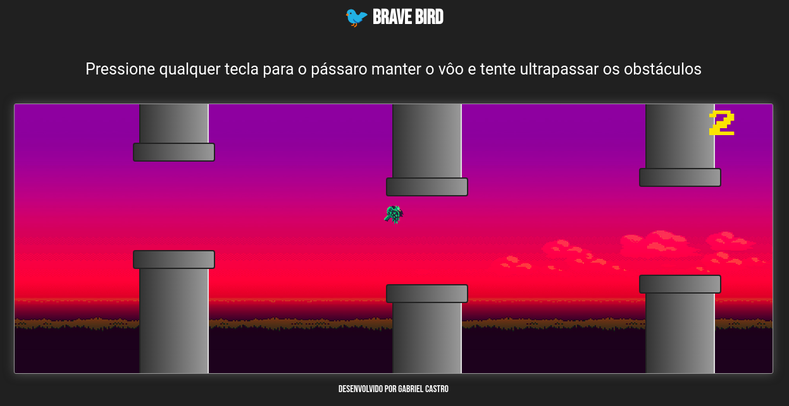

# Sobre o projeto

### Brave Bird




O projeto consiste em um jogo inspirado no já bastante conhecido FlappyBird, usado apenas os fundamentos de Html, Css e javascript com a manipulação da DOM.

### Tecnologias Utilizadas

O projeto utiliza as seguintes tecnologias:

1. JavaScript
2. CSS 3 (Puro)
3. HTML 5

## 💻 Pré-requisitos

* Um Browser (Chrome, Firefox ...)

## 🚀 Instalando o Projeto

Para instalar, siga estas etapas:

Linux:
```bash
    # clonar repositório
    git clone https://github.com/gabrielcastroo/bv-bird
    # Abrir main.html
```

Windows:
```powershell
    # clonar repositório
    git clone https://github.com/gabrielcastroo/bv-bird
    # Abrir main.html
```

## Autor

Criado por Gabriel Castro, programador e estudante dos cursos de Bacharelado em Ciência da Computação e Técnico em Desenvolvimento de Sistemas Educacionais.

